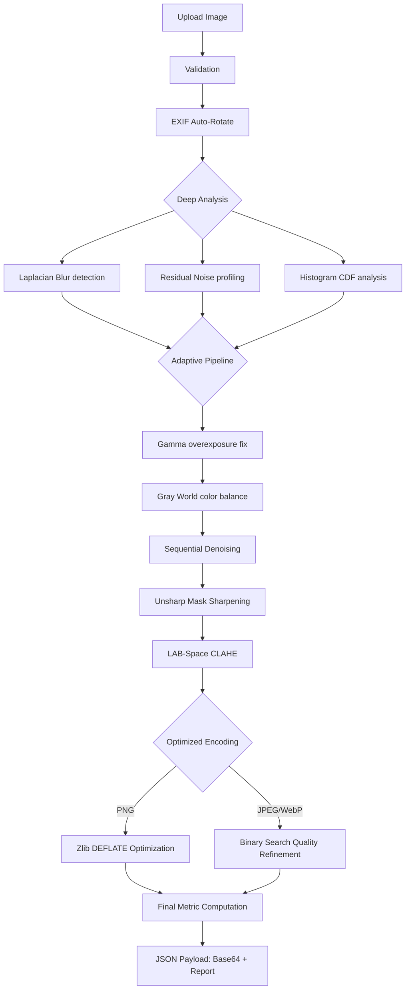

# PixelPerfect Pro (v2.0.0) — Technical Reference

PixelPerfect Pro is a high-performance, full-stack Image Enhancement and Compression platform. It integrates advanced **Digital Image Processing (DIP)** algorithms with a focus on real-time quality analysis, adaptive correction, and precision storage optimization.

---

## 🏗️ System Architecture

### End-to-End Workflow


### Directory Structure
```text
.
├── backend/
│   ├── app.py              # Flask server & Orchestration logic
│   ├── utils/
│   │   ├── analysis.py     # Mathematical detection algorithms
│   │   └── enhancement.py  # DIP correction implementation
│   └── requirements.txt    # dependencies (OpenCV, NumPy, Pillow)
├── frontend/
│   ├── src/
│   │   ├── components/     # Modular React UI (Upload, Result, Metrics)
│   │   ├── services/       # Axios-based API client
│   │   ├── App.jsx         # Global state & Layout
│   │   └── index.css       # Tailwind Pro UI design
│   └── vite.config.js      # Build configuration
├── render.yaml             # Backend deployment (Render)
├── netlify.toml            # Frontend deployment (Netlify)
└── README.md               # You are here
```

---

## 🔬 Mathematical Deep Dive: Analysis Logic

### 1. Adaptive Blur Detection
The system uses the **Variance of Laplacian** method. The Laplacian operator highlights regions of rapid intensity change (edges).
- **Mathematical Form**: $\nabla^2 f = \frac{\partial^2 f}{\partial x^2} + \frac{\partial^2 f}{\partial y^2}$
- **Discrete Kernel**: $\begin{bmatrix} 0 & 1 & 0 \\ 1 & -4 & 1 \\ 0 & 1 & 0 \end{bmatrix}$
- **Logic**: A blurred image has low edge response. We calculate the variance $\sigma^2$ of the Laplacian. If $\sigma^2 < \tau$, the image is classified as blurred.
- **Dynamic Thresholding**: The threshold $\tau$ is adjusted based on edge density (calculated via Canny) to avoid false positives on low-detail images.

### 2. Bayesian-lite Noise Classification
The system distinguishes between Gaussian (sensor) noise and Salt-and-Pepper (impulse) noise.
- **S&P Ratio**: Calculated as the density of "dead" pixels (extreme 0 or 255 values).
- **Gaussian Estimation**: A residual map is created: $R = |I - \text{MedianBlur}(I)|$. The mean of $R$ estimates the global noise floor.

### 3. Tonal & Exposure Analysis
- **Mean Intensity ($\mu$)**: Global brightness average.
- **Histogram CDF**: The Cumulative Distribution Function $C(i) = \sum_{j=0}^{i} P(j)$ is used to find the median intensity. If the intensity at $C(0.5)$ is too high or low, exposure correction is triggered.

---

## 🛠️ Mathematical Deep Dive: Enhancement Logic

### 1. Gray World Color Correction (Auto-Balance)
Assumes that the average of all channels in a scene should be neutral gray.
- **Gain Calculation**: $Gain_C = \frac{\mu_{gray}}{\mu_C}$ for $C \in \{R, G, B\}$.
- **Correction**: Each pixel $I_C' = \text{clip}(I_C \cdot Gain_C, 0, 255)$.

### 2. Power-Law (Gamma) Correction
Used to restore details in overexposed (high-key) images.
- **Equation**: $s = c \cdot r^\gamma$
- **Implementation**: We iterate a Look-Up Table (LUT) for performance. For overexposure, we use $\gamma < 1$ (typically $0.6$).

### 3. Micro-Contrast Sharpening (Unsharp Mask)
Enhances edges by blending the original image with a high-pass filtered version.
- **Equation**: $I_{sharp} = I_{orig} + \alpha \cdot (I_{orig} - I_{blur})$
- **Logic**: $\alpha$ is the user-defined strength. A Gaussian blur serves as the low-pass reference.

### 4. CLAHE (Contrast Limited Adaptive Histogram Equalization)
Unlike standard AHE, CLAHE limits contrast amplification to reduce noise in flat regions.
- **Mechanism**: Operates in **LAB color space** on the **L-channel** only to preserve color fidelity.
- **Tile Grid**: The image is split into $8 \times 8$ tiles. Histograms are equalized independently and blended using bilinear interpolation.

---

## 📉 Compression & Optimization Engine

### 1. Binary Search Quality Refinement
For JPEG and WebP, the system performs an $O(\log N)$ search to achieve a user-defined target KB.
1.  **Initial quality range**: $Q \in [5, 95]$.
2.  **Iteration**: Try $Q_{mid}$.
3.  **Measurement**: If $\text{Size}(Q_{mid}) \le \text{Target}$, set $best=Q_{mid}$ and try higher quality. Else, try lower quality.
4.  **Result**: Guarantees the highest possible quality that fits within the storage budget.

### 2. Lossless PNG Pipeline
- **Filter Heuristics**: Evaluates PNG filters (None, Sub, Up, Average, Paeth) per scanline.
- **Zlib Intensity**: Uses compression level 6 with `optimize=True` for maximum size reduction without visual loss.

---

## 📊 Technical Metrics Definitions

| Metric | Mathematical Definition | Physical Meaning |
| :--- | :--- | :--- |
| **Sharpness** | $\text{Var}(\nabla^2 I)$ | Edge definition and focal accuracy. |
| **Contrast** | $\sigma = \sqrt{\frac{1}{N}\sum(x_i - \mu)^2}$ | Dynamic range of pixel intensities. |
| **PSNR** | $10 \log_{10}(\frac{255^2}{MSE})$ | Fidelity of restored pixels vs original. |
| **SNR** | $20 \log_{10}(\frac{\mu}{\sigma})$ | Signal clarity vs background artifacts. |

---

## 🌐 API Specification

### `POST /process-image`
Multi-part form data request.

**Parameters**:
- `image`: Binary file (JPEG, PNG, WebP, etc.).
- `sharpness`: [0.0 - 5.0] (-1 for Auto).
- `noise`: [0.0 - 10.0] (-1 for Auto).
- `color`: [0.0 - 1.0] (-1 for Auto).
- `contrast`: [0.0 - 4.0] (-1 for Auto).
- `format`: Output format (png/jpeg/webp).
- `target_size_kb`: KB limit (0 for disabled).

**Response**:
```json
{
  "enhanced_image": "data:image/png;base64,...",
  "analysis": { "blur": true, "noise_type": "gaussian", "brightness": "low" },
  "metrics": { "psnr": 34.5, "sharpness_after": 120.4, ... }
}
```

---

## 🚀 Installation & Deployment

### Local Environment
1.  **Backend**: `cd backend && python -m venv venv && pip install -r requirements.txt && python app.py`
2.  **Frontend**: `cd frontend && npm install && npm run dev`

### Production Deployment
- **Backend (Render)**: Set `GUNICORN_CMD_ARGS` for production workers. Auto-rotatable memory recommended for large images.
- **Frontend (Netlify)**: Connect GitHub repo. Set `VITE_API_BASE_URL` to your Render endpoint.
